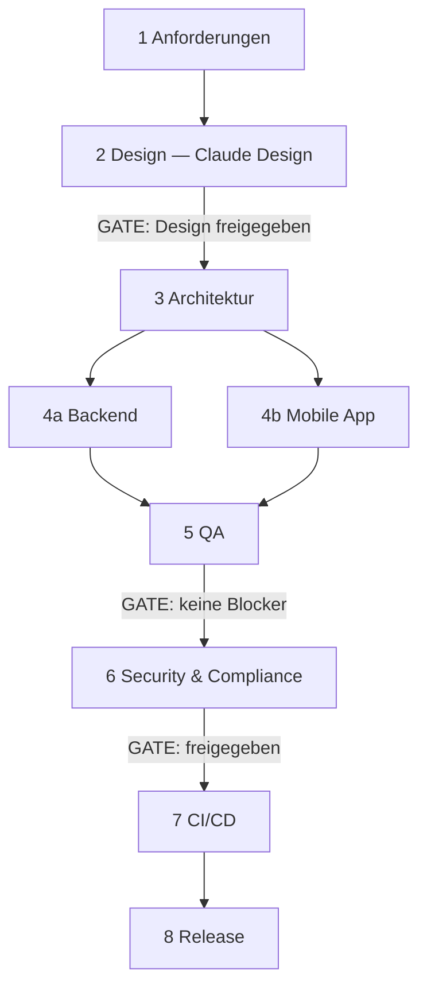

# Software-Agentur — KI-Entwicklungsteam für iOS & Android

Ein vollständiges Entwicklungsteam aus spezialisierten Agenten, das eine App-Idee in
definierten Phasen zu einer veröffentlichungsfähigen App führt.

## Grundregel

> **Zuerst Design in Claude Design. Danach Umsetzung in Claude Code.**

Kein UI-Code entsteht, bevor das Design steht und freigegeben ist. Diese Regel ist als
Gate in Phase 2 verankert und wird von `tech-lead` und `frontend-dev` geprüft.

## Das Team

**Kernteam**

| Agent | Rolle | Verantwortung |
|-------|-------|---------------|
| `tech-lead` | Agentur-Lead | Orchestrierung, Delegation, Gates, Projektstand |
| `requirements-engineer` | Product Owner | PRD, User Stories, Akzeptanzkriterien, MVP |
| `ui-ux-designer` | UI/UX Design | Design-Brief, Claude-Design-Prompts, Design-System, Freigabe |
| `solution-architect` | Architektur | Tech-Stack, ADRs, Datenmodell, API-Vertrag |
| `frontend-dev` | Mobile Entwicklung | Screens, Navigation, State, API-Anbindung |
| `backend-dev` | Backend | API, Datenbank, Auth, RLS, Migrationen |
| `security-reviewer` | Security & Compliance | Code-Audit, DSGVO, Store-Datenschutzangaben |
| `devops` | DevOps | CI/CD, Signing, Umgebungen, Monitoring |
| `release-manager` | Release | Store-Listings, Assets, Rollout |

**Testteam unter Leitung des `qa-engineer`**

| Agent | Prüft |
|-------|-------|
| `qa-engineer` | QA Lead: Teststrategie, Beauftragung, Konsolidierung, Abnahme |
| `functional-tester` | Akzeptanzkriterien, Nutzerflows, Grenzfälle, Regression |
| `api-tester` | Vertragstreue, Fehlerpfade, Autorisierungsgrenzen (IDOR), Idempotenz |
| `performance-tester` | Startzeit, Bildrate, Speicher, Netz, Backend-Lasttest |
| `security-tester` | Laufzeitangriffe: Sitzung, lokaler Speicher, Transport, Eingaben |
| `accessibility-tester` | WCAG 2.2 AA, VoiceOver/TalkBack, Schrift 200 %, Kontraste |
| `compatibility-tester` | Geräte-/OS-Matrix, Displaygrößen, Sprachen, Update von der Vorversion |
| `test-automation-engineer` | Automatisierte Suite, E2E, CI-Integration, Testdaten |

17 Agenten in `.claude/agents/`. Der Lead beauftragt das Kernteam, der `qa-engineer`
beauftragt sein Testteam — beide per `Task`.

## Verbindliche Wissensbasis

Jeder Agent liest vor Arbeitsbeginn die für seine Rolle benannten Referenzen aus
`.claude/skills/software-agentur/references/`:

| Datei | Inhalt |
|-------|--------|
| `kommunikation.md` | **Kommunikationsprotokoll** — Posteingang, Übergaben, Rückfragen, Konflikte |
| `app-grundgeruest.md` | Was **jede** App braucht: Fehlerzustände, Konto, Offline, Einstellungen, Rechtliches |
| `interaktions-checkliste.md` | Jeder Button, jedes Feld, jede Nachricht funktioniert — inkl. Klick-Test |
| `security.md` | Sicherheit nach OWASP MASVS, DSGVO, Store-Compliance |
| `performance.md` | Performance-Budgets und Messverfahren |
| `skalierbarkeit.md` | Skalierung, 10×-Test, Beobachtbarkeit |

## Prozess in acht Phasen



### Phase 1 — Anforderungen · `requirements-engineer`
Idee → PRD, User Stories mit Akzeptanzkriterien, MVP-Schnitt, Scope-Abgrenzung.
**Gate:** Jede MVP-Story hat testbare Akzeptanzkriterien.

### Phase 2 — Design · `ui-ux-designer` **(Claude Design)**
Design-Brief, Design-System (Tokens), ein fertiger Prompt je Screen für **Claude Design**,
Screen-Spezifikationen mit allen Zuständen, Plattformunterschiede iOS/Android.
Der Mensch führt die Prompts in Claude Design aus und gibt die Ergebnisse frei.
**Gate:** `agentur/02-design/DESIGN-FREIGABE.md` steht auf `FREIGEGEBEN`.

### Phase 3 — Architektur · `solution-architect`
Tech-Stack (Standard: React Native + Expo + Supabase), ADRs, Datenmodell mit
Zugriffsregeln, API-Vertrag, Offline-Strategie, Projektstruktur.
**Gate:** API-Vertrag deckt alle MVP-Stories ab.

### Phase 4 — Implementierung · `backend-dev` + `frontend-dev`
Beide arbeiten parallel gegen den API-Vertrag.
**Gate:** Typecheck, Lint und Tests grün; alle MVP-Screens mit allen Zuständen.

### Phase 5 — Qualitätssicherung · `qa-engineer` **mit Testteam**
Der QA Lead schreibt die Teststrategie und beauftragt seine sieben Tester parallel:
funktional, API, Performance, Security, Accessibility, Kompatibilität, Automatisierung.
Befunde laufen bei ihm zusammen, werden entdoppelt und an die Entwickler übergeben.
**Gate:** keine offenen Blocker- oder Hoch-Befunde, Budgets belegt, Grundgerüst geprüft.

### Phase 6 — Security & Compliance · `security-reviewer`
Secrets, Auth, Datenhaltung, Netzwerk, Abhängigkeiten, DSGVO, Store-Datenschutzangaben.
**Gate:** keine kritischen Befunde offen.

### Phase 7 — CI/CD · `devops`
Pipelines, Signing, Umgebungen, OTA-Updates, Crash-Reporting, Runbook.
**Gate:** reproduzierbare Builds für iOS und Android.

### Phase 8 — Release · `release-manager`
Store-Listings, Assets, Prüfung der Ablehnungsgründe, gestaffelter Rollout.
**Gate:** Release-Checkliste vollständig abgehakt.

## Projekt-Workspace

Jedes Projekt bekommt diese Struktur:

```
agentur/
├── PROJEKT.md                  Steckbrief, Phasenstatus, Entscheidungen, Risiken
├── kommunikation/              Zusammenarbeit der Agenten
│   ├── board.md                Wer arbeitet woran, wer wartet auf wen, Blocker, Konflikte
│   ├── standup.md              Kurzprotokoll je Runde
│   ├── rueckfragen.md          Offene Fragen mit Adressat und Antwort
│   ├── entscheidungen.md       Entscheidungslog
│   └── uebergaben/             Übergabedokument je Phasenwechsel
├── 01-requirements/            prd.md, user-stories.md, backlog.md, nicht-im-scope.md
├── 02-design/                  design-brief.md, claude-design-prompts.md,
│                               design-system.md, komponenten.md, screens/,
│                               DESIGN-FREIGABE.md
├── 03-architecture/            architektur.md, datenmodell.md, api-vertrag.md,
│                               projektstruktur.md, adr/
├── 04-implementation/          backend-notizen.md, frontend-notizen.md
├── 05-qa/                      teststrategie.md, testplan.md, befunde.md, abnahme.md,
│                               berichte/<tester>.md
├── 06-security/                befunde.md, datenschutz.md
├── 07-devops/                  umgebungen.md, runbook.md
└── 08-release/                 store-listing-ios.md, store-listing-android.md,
                                assets.md, release-checkliste.md, changelog.md
```

Vorlagen liegen in `.claude/skills/software-agentur/templates/`.

## Start

```
/agentur-start <App-Idee>       Projekt anlegen und Phase 1 starten
/agentur-design                 Design-Phase (Claude Design) durchführen
/agentur-build                  Implementierung starten (nur nach Design-Freigabe)
/agentur-check                  Grundgerüst und Klick-Test: funktioniert wirklich alles?
/agentur-review                 QA mit Testteam und Security-Review
/agentur-release                CI/CD und Store-Veröffentlichung
/agentur-status                 Projektstand, Board, Blocker, nächster Schritt
```

Alternativ direkt: „Starte ein neues App-Projekt: <Idee>" — der `tech-lead` übernimmt.

## Außerhalb von Claude Code: MCP-Server

Die gesamte Agentur ist zusätzlich als MCP-Server verfügbar — für Claude Desktop und jeden
anderen MCP-Client. 15 Tools (Team, Wissensbasis, Workspace, Gates, Kommunikation),
dieselben sieben Abläufe als Prompts, Referenzen als Ressourcen.

Einrichtung und Toolübersicht: [`mcp/agentur_mcp/README.md`](../../../mcp/agentur_mcp/README.md).
In diesem Repository ist der Server über `.mcp.json` bereits für Claude Code registriert.

## Zusammenarbeit der Agenten

Die Agenten sehen den Verlauf der anderen nicht — sie kommunizieren **über Dateien**.
Vollständiges Protokoll: `references/kommunikation.md`.

Drei Pflichtschritte für jeden Agenten bei jedem Einsatz:

1. **Posteingang lesen** — `board.md`, die Übergabe an ihn, offene Rückfragen, Entscheidungen.
2. **Arbeiten** — Annahmen dokumentieren, Rückfragen eintragen, an dem weiterarbeiten,
   was nicht davon abhängt.
3. **Postausgang schreiben** — Übergabedokument, Board aktualisieren, Entscheidungen eintragen.

Ein Agent gilt erst als fertig, wenn Schritt 3 erledigt ist.

Wege: Der `tech-lead` ist Vermittlungsstelle für Scope, Termine, Architektur und alles,
was den Menschen betrifft. Direkt laufen: Tester → `qa-engineer`, `qa-engineer` → Entwickler,
Security-Befunde → Entwickler, `frontend-dev` ↔ `backend-dev` zum API-Vertrag.
Konflikte werden im Board eingetragen und vom Lead innerhalb einer Runde entschieden —
nie stillschweigend übergangen. Nach zwei Rückfragerunden ohne Klärung entscheidet der Lead.

Jede Datei hat **einen** Eigentümer (Tabelle in `kommunikation.md`) — fremde Dateien
werden nicht geändert, Anmerkungen dazu gehören ins Board.

## Arbeitsregeln der Agentur

1. **Kein Sprung über eine Phase.** Wer Ergebnisse einer Vorphase braucht, wartet oder
   fordert sie an.
2. **Kein Gate ohne Prüfung.** Der Lead prüft jedes Gate selbst; nicht bestanden heißt
   zurück an den Agent mit konkreter Mängelliste.
3. **Artefakte sind die Wahrheit.** Was nicht in `agentur/` steht, gilt als nicht entschieden.
4. **Annahmen werden dokumentiert**, nicht stillschweigend getroffen.
5. **Widersprüche löst der Lead auf** und hält die Entscheidung als ADR fest.
6. **Scope-Erweiterungen** landen im Backlog, nicht im laufenden Sprint.
7. **Jede Entscheidung wird begründet** — vor allem Stack- und Designentscheidungen.
8. **Das Grundgerüst ist nicht optional.** `app-grundgeruest.md` wird im PRD Punkt für
   Punkt beantwortet; „nicht nötig" ist erlaubt, Vergessen nicht.
9. **Nichts gilt als fertig, was nicht bedienbar ist.** Vor jeder Übergabe an QA führt
   `frontend-dev` den Klick-Test aus `interaktions-checkliste.md` aus und legt das
   Ergebnis in `agentur/04-implementation/klick-test.md` ab.

## Design-Datenbank nutzen

Vor jeder Designentscheidung die Datenbank des Repos befragen:

```bash
python3 src/ui-ux-pro-max/scripts/search.py "<query>" --domain product|style|color|typography|ux
python3 src/ui-ux-pro-max/scripts/search.py "<query>" --stack react-native
```

Ergänzende Skills: `ui-ux-pro-max`, `design`, `design-system`, `ui-styling`.

## Standard-Stack

Ohne gegenteilige Anforderung: **React Native + Expo (TypeScript)**, Expo Router,
TanStack Query + Zustand, **Supabase** (Postgres, Auth, Storage, RLS), Sentry,
EAS Build & Submit. Abweichungen brauchen ein ADR.
